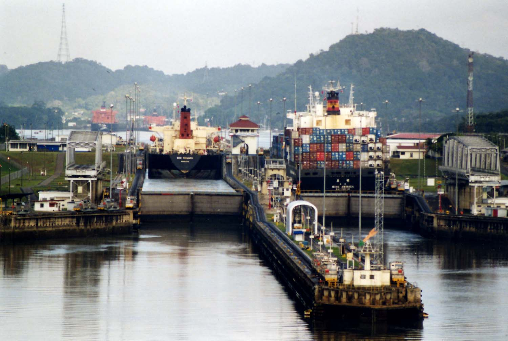

<!--
SPDX-FileCopyrightText: 2024 Pablo Portas López

SPDX-License-Identifier: MIT
-->

# Panamax 🚢📦

**Panamax** 🚢📦 es una recopilación de [Docker Composes](https://docs.docker.com/compose/) que me han sido útiles a lo largo
de mi breve experiencia como [Self-Hoster](https://es.wikipedia.org/wiki/Self-hosting).

> ⚠️ Este repositorio está en **desarrollo activo**, se esperan cambios frecuentes. ⚠️

# Composes 📚

# ¿Porqué Panamax? 🚢

El nombre del repositorio es en honor a los barcos de [la clase Panamax](https://es.wikipedia.org/wiki/Panamax). Ya que
van llenos de containers, pues este repositorio también está lleno. 🚢
